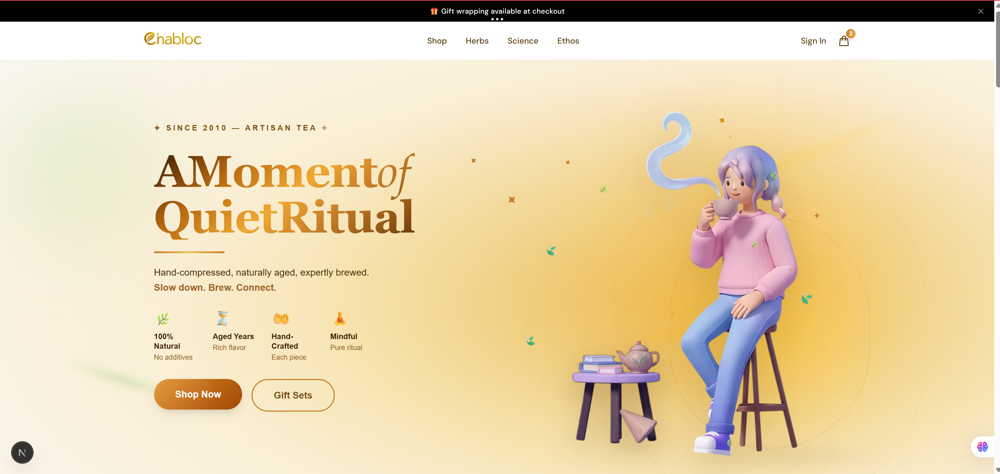

# 🚀 Launch Your Tea Shop in 30 Minutes

A clean, modern e-commerce starter built with Next.js.

No backend setup. No database required.  
Just install and run.

## 🖼️ Preview




## ✨ Features

- ⚡ Works immediately after install (no setup needed)
- 📱 Fully responsive (mobile, tablet, desktop)
- 🛒 Complete shopping flow (product → cart → checkout)
- 💳 Demo checkout included (no payment setup required)
- 🧩 Simple product data structure (easy to edit)
- 🎯 Clean and scalable code (developer-friendly)

---

## 👤 Who is this for?

- Freelancers building client shops
- Small business owners who want to launch fast
- Developers who want a ready-to-use e-commerce base

---

## ⚡ Quick Start (after purchase)

```bash
npm install
npm run dev


